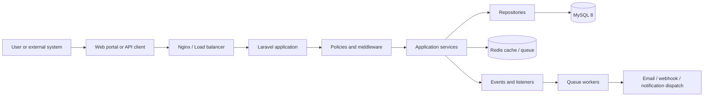

# System Architecture

## Purpose

Delivery Portal is a multi-tenant SaaS platform that exposes secure REST APIs and a premium operator portal for external companies integrating their own systems with the delivery network.

## Design goals

- Support thousands of companies and millions of delivery requests.
- Keep the initial monolith modular enough for future service extraction.
- Preserve strong domain boundaries with repository and service layers.
- Provide enterprise-grade security, auditability, and observability.
- Keep the UI and API surfaces consistent, versioned, and testable.

## High-level components

1. Public landing website for marketing and documentation entry points.
2. Authentication and onboarding for company registration and access control.
3. Client portal for deliveries, customers, drivers, API keys, and webhooks.
4. Admin portal for support, operations, analytics, and system administration.
5. REST API under `/api/v1` for first-class external integration.
6. Queue-based background workers for notifications, webhooks, and asynchronous lifecycle jobs.
7. Redis for caching, queueing, throttling, and ephemeral workflow state.
8. MySQL 8 as the source of truth with normalized transactional schema.

## Core architecture pattern

The platform uses a modular monolith with clear domain seams:

- Presentation layer: controllers, requests, resources, UI routes, and pages.
- Application layer: services, DTOs, use-case orchestration, jobs, and listeners.
- Domain layer: entities/models, policies, rules, value objects, and domain events.
- Infrastructure layer: repositories, queue adapters, notifications, mail, storage, and integrations.

This structure keeps the system maintainable now and migration-friendly later.

## Request flow

## Scalability model

- Stateless application nodes behind a load balancer.
- Redis-backed queues with dedicated workers by workload.
- Read-heavy endpoints optimized with caching and projection tables where needed.
- Audit and activity logging isolated from business-write paths.
- API rate limits enforced per company, token, route, and action class.

## Security model

- Sanctum authentication for portal sessions and API tokens.
- CSRF protection for browser flows.
- Signed webhooks and token rotation for machine integrations.
- Strict authorization policies and permission middleware.
- Validation at the request boundary and a standardized error envelope.
- Encrypted secrets and audit logging for sensitive operations.

## Frontend model

- React 19 SPA-like experience with route-based module boundaries.
- Shared design system for tables, charts, forms, dialogs, and empty states.
- TanStack Query for server state and Axios-based API transport.
- Motion used selectively for meaningful transitions, not decoration.

## Deployment model

- Docker Compose for local and staging parity.
- Nginx as the primary reverse proxy.
- Apache compatibility layer where required by hosting environments.
- GitHub Actions for build, test, and release automation.
- Separate configuration for development, staging, and production.
